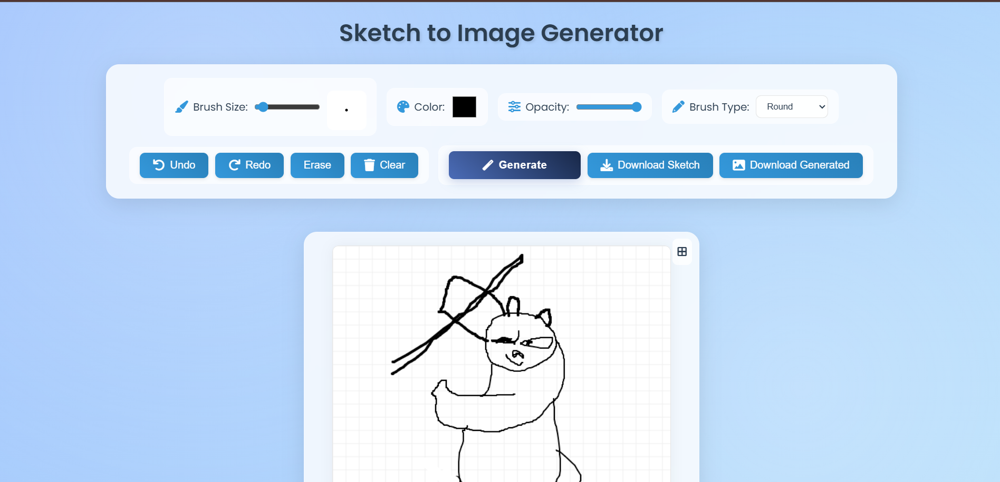
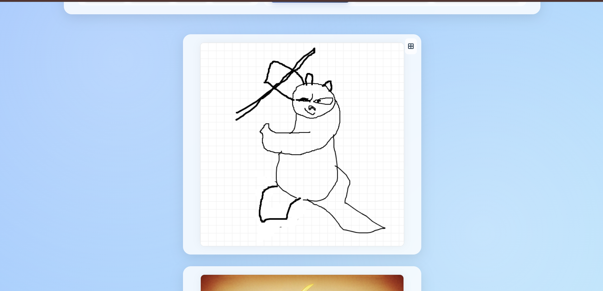
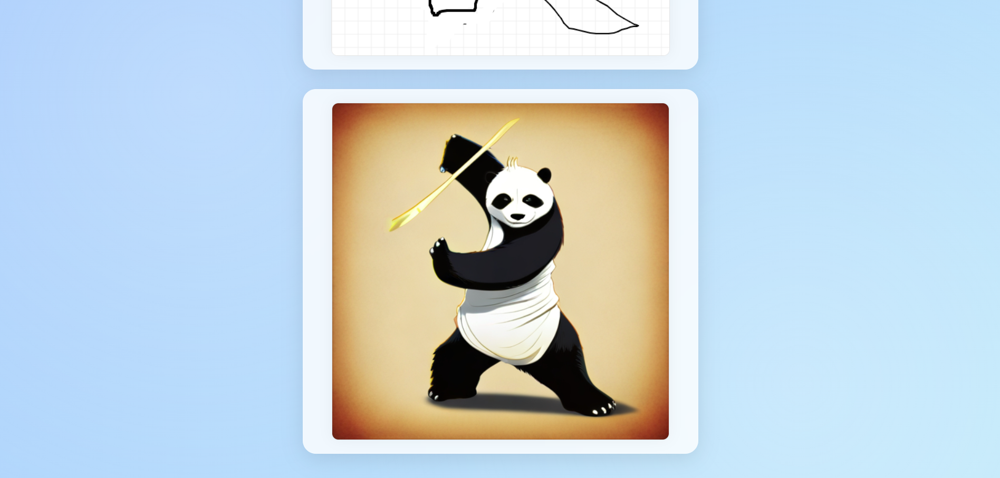

# 🎨 Sketch-to-Image Web App
    
<div align="center">
  
  
  
  
</div>

<p align="center">
  <strong>Transform your sketches into stunning AI-generated images with the power of LightX API</strong>
</p>

---

## 🌟 Overview

This innovative web application bridges the gap between traditional sketching and modern AI technology. Users can draw sketches directly in their browser and watch as artificial intelligence transforms their creative ideas into photorealistic images using the advanced LightX Sketch-to-Image API.

## ✨ Features

- 🎨 **Interactive Canvas Drawing Board** – Intuitive drawing tools for creating sketches directly in the browser
- 🤖 **AI-Powered Image Generation** – Leverages LightX API's advanced algorithms to transform sketches into realistic images
- 🖼️ **Side-by-Side Comparison** – Real-time display of original sketches alongside generated images
- ⚡ **Optimized User Interface** – Responsive design using modern CSS Grid and Flexbox
- 🚫 **Smart Input Validation** – Prevents blank submissions and ensures quality input
- 💾 **Download Functionality** – Save both original sketches and generated images
- 📱 **Mobile-Friendly** – Responsive design that works across all devices

## 🛠️ Technology Stack

| Frontend | Backend | API Integration |
|----------|---------|-----------------|
| HTML5 Canvas | Flask (Python) | LightX Sketch-to-Image API |
| CSS3 (Grid/Flexbox) | Python 3.8+ | RESTful API Integration |
| Vanilla JavaScript | Flask-CORS | JSON Data Handling |

## 🚀 Quick Start

### Prerequisites
- Python 3.8 or higher
- Git
- LightX API Key (free tier available)

### Installation

1. **Clone the Repository**
   ```bash
   git clone https://github.com/santhoshkrishna-2004/Sketch-To-Image-Web-App.git
   cd Sketch-To-Image-Web-App
   ```

2. **Install Dependencies**
   ```bash
   pip install -r requirements.txt
   ```

3. **Environment Setup**
   Create a `.env` file in the root directory:
   ```env
   LIGHTX_API_KEY=your_api_key_here
   ```
   
   > 💡 **Get your free API key:** Visit [LightX API](https://www.lightxeditor.com/api/) and click "Get Your API Key For Free"

4. **Launch the Application**
   ```bash
   python app.py
   ```

5. **Access the App**
   Open your browser and navigate to: `http://127.0.0.1:5000/`

## 📖 How to Use

1. **Draw Your Sketch** – Use the drawing tools on the canvas to create your artwork
2. **Add Description** – Provide a detailed description of what you want the AI to generate
3. **Generate Image** – Click the "Generate" button to process your sketch
4. **View Results** – Compare your original sketch with the AI-generated image
5. **Download** – Save either your sketch or the generated image using the download buttons

## 🖼️ Demo

<div align="center">

### User Interface


### Input Sketch Example


### AI-Generated Result


</div>

## 👥 Our Team

| Team Member | Role | Key Responsibilities |
|-------------|------|---------------------|
| <br>**Shyam** | 🎯 **Team Lead & API Integration Specialist** | • Project management and coordination<br>• LightX API integration and optimization<br>• System architecture design<br>• Team workflow supervision |
| <br>**Santosh Krishna** | 🎨 **Frontend Developer** | • UI/UX design and implementation<br>• Canvas drawing functionality<br>• Responsive web design<br>• User interface optimization |
| <br>**Abhinav** | 🔧 **Backend Developer** | • Flask application development<br>• Server-side logic implementation<br>• Database management<br>• API endpoint creation |
| <br>**Ajay** | 🧪 **Quality Assurance Tester** | • Testing protocols development<br>• Bug identification and reporting<br>• Performance optimization testing<br>• User experience validation |

## 📁 Project Structure

```
sketch-to-image/
├── app.py                 # Main Flask application
├── requirements.txt       # Python dependencies
├── .env                  # Environment variables (not tracked)
├── static/
│   ├── css/
│   │   └── style.css     # Application styles
│   ├── js/
│   │   └── script.js     # Frontend JavaScript
│   └── temp_images/      # Demo images
├── templates/
│   └── index.html        # Main HTML template
└── README.md             # Project documentation
```

## 🔧 API Configuration

The application uses the LightX Sketch-to-Image API. Key features:

- **Free Tier Available**: Start with free API calls
- **High-Quality Results**: Advanced AI models for realistic image generation
- **Fast Processing**: Optimized for quick turnaround times
- **Flexible Input**: Supports various sketch styles and descriptions

## 🤝 Contributing

We welcome contributions from the community! Here's how you can help:

1. **Fork the Repository**
2. **Create a Feature Branch** (`git checkout -b feature/AmazingFeature`)
3. **Commit Your Changes** (`git commit -m 'Add some AmazingFeature'`)
4. **Push to the Branch** (`git push origin feature/AmazingFeature`)
5. **Open a Pull Request**

### Development Guidelines

- Follow PEP 8 style guidelines for Python code
- Write clear, descriptive commit messages
- Add comments for complex functionality
- Test your changes thoroughly before submitting

## 📝 License

This project is licensed under the MIT License - see the [LICENSE](LICENSE) file for details.

## 🙏 Acknowledgments

- **LightX Team** for providing the powerful Sketch-to-Image API
- **Open Source Community** for the amazing tools and libraries
- **Beta Testers** who helped improve the application

## 📞 Support

If you encounter any issues or have questions:

- 🐛 **Bug Reports**: [Open an Issue](https://github.com/santhoshkrishna-2004/Sketch-To-Image-Web-App/issues)
- 💡 **Feature Requests**: [Request a Feature](https://github.com/santhoshkrishna-2004/Sketch-To-Image-Web-App/issues)
- 📧 **General Questions**: Contact the team leads

---

<div align="center">
  <p><strong>Made with ❤️ by the Sketch-to-Image Team</strong></p>
  <p>⭐ Star this repository if you found it helpful!</p>
</div>

